# Pretty Pandas

PrettyPandas uses the new Pandas style API to add beautiful reporting 
functionality to Pandas DataFrames.

## Features:

* Multiple summary rows and columns

* A nice and customizable theme

* Number formatting for currency, scientific units, and percentages

## Usage

Add a simple total:

```
PrettyPandas(df).total()
```

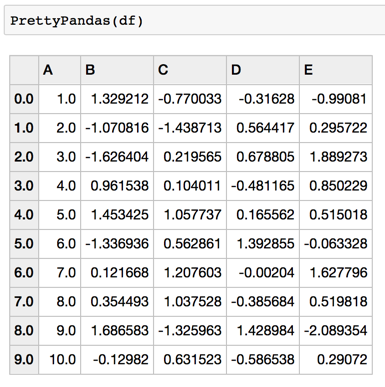

Add an average:

```
PrettyPandas(df).average()
```


Add an average across the table:

```
PrettyPandas(df).average(axis=1)
```

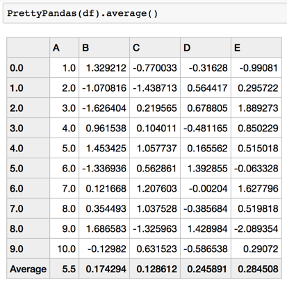

Add an average across and down the table:

```
PrettyPandas(df).average(axis=None)
```

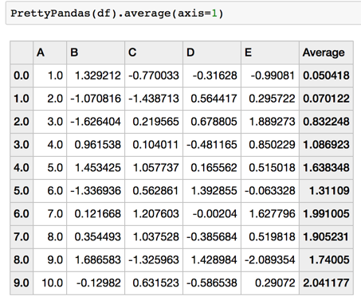

Summaries can be chained together:

```
PrettyPandas(df).min().max()
```

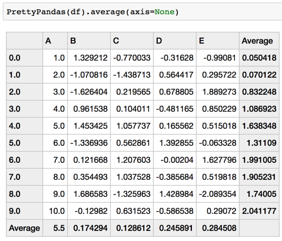

Custom functions can be used for summaries:

```
PrettyPandas(df).summary(np.mean, "Average")
```

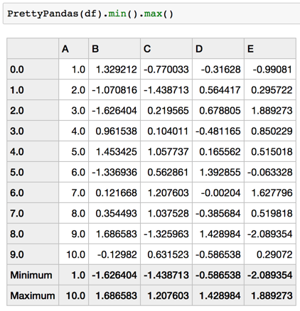

### Multiple Summary Functions

Multiple summaries can be applied at the same time using the `multi_summary` 
method.

```
PrettyPandas(df).multi_summary([np.mean, np.sum],
                               ['Average', 'Total'],
                               axis=0)
```

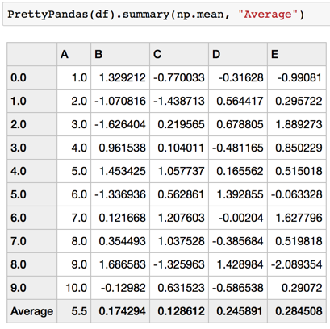


Multiple summaries have the exact same API as regular summaries which means all
the above examples work with no surprises.

### Number Formatting

PrettyPandas has built in support for money, percentages, and units.

```
PrettyPandas(df).as_percent()
```

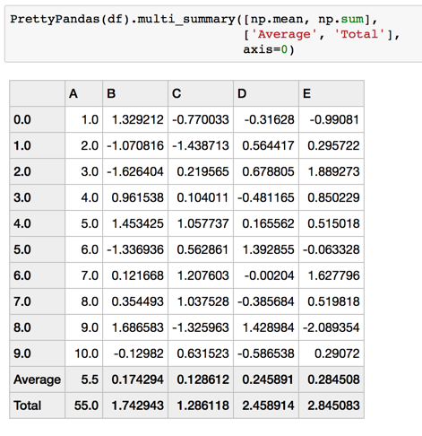


```
PrettyPandas(df).as_money()
```

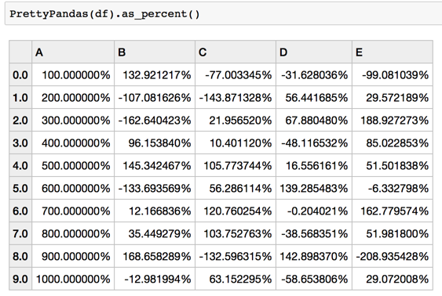


```
PrettyPandas(df).as_percent(precision=3)
```

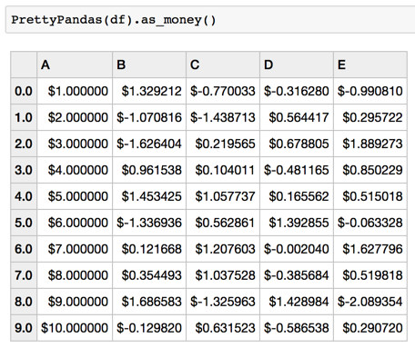


```
PrettyPandas(df).as_money(currency=u"$", precision=3)
```

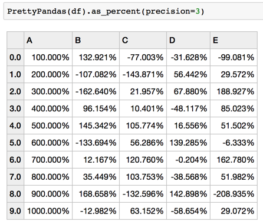


```
PrettyPandas(df).as_unit('cm', location='suffix')
```

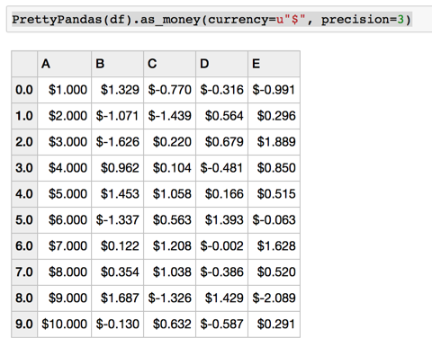


Number formatting conforms to standard Pandas indexing and slicing:

```
PrettyPandas(df).as_percent(subset=['A'])
```

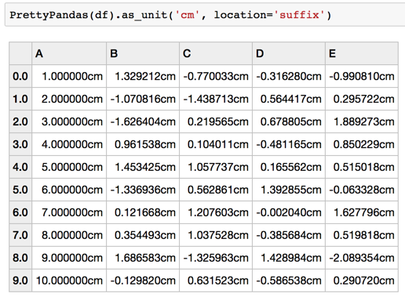


Number formats will be applied to summaries as well. 

```
PrettyPandas(df).as_percent(subset=['A']).total()
```

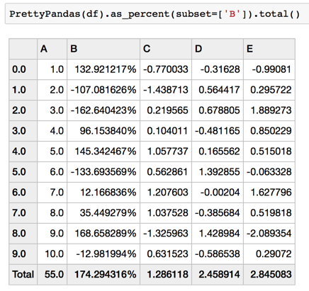


## Issues

* This class doesn't conform to the regular Styler.export function, which
means at the current time you cannot use the `export` and `style.use`
functions of a dataframe. Instead you can build a function which to
template table styles and use that to clone styles.

* Modifying the underlying dataset uses a copy and ignores any performance
issues. This means applying formats to large dataframes could be slow and
memory could be an issue.

* Summaries which you might want to interact (like the intersection of two
totals) will not be rendered. This is a design decision because most summary
functions don't need to interact don't interact nicely.

* Summary functions don't take a subset argument which means that any
summary will be applied to every column or row.

* Number formatting fails on nulls.
