# Pretty Pandas


PrettyPandas uses the new Pandas style API to add beautiful reporting
functionality to Pandas DataFrames.

## Features:

* Add multiple summary rows and columns.
* A nice and customizable theme.
* Number formatting for currency, scientific units, and percentages.
* Chaining commands
* Works seemlessly with [Pandas Style API](http://pandas.pydata.org/pandas-docs/stable/style.html)

[Demo Notebook](http://nbviewer.jupyter.org/github/HHammond/PrettyPandas/blob/master/docs/PrettyPandas%20Demo.ipynb)

## Installation

PyPI package:

```sh
pip install prettypandas
```


Manual installation:

```sh
git clone git@github.com:HHammond/PrettyPandas.git
cd PrettyPandas
python setup.py install
```

Pretty Pandas supports CPython versions 2.7, 3.3, 3.4, and 3.5.

## Pretty IPython Notebooks

Pretty Pandas has a magic function, `apply_pretty_globals()` which will inject HTML into the notebook which enables pretty styling of all tables. 

**Warning:** the magic function injects HTML and CSS code into the notebook itself, you should be cautious of where you use it (some notebook hosts don't support CSS injection). 

## Adding a Summary

PrettyPandas supports:

* `average`
* `total`
* `min`
* `max`
* `median`

The `summary` method takes a function and title and to create a custom summary.

Add a simple total:

```
from prettypandas import PrettyPandas

PrettyPandas(df).total()
```

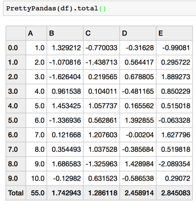

Add an average:

```
PrettyPandas(df).average()
```

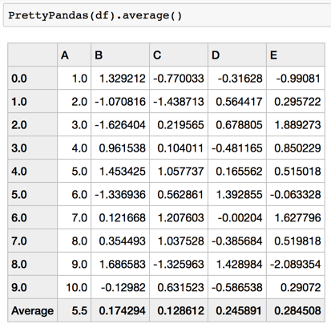

Add an average across the table:

```
PrettyPandas(df).average(axis=1)
```

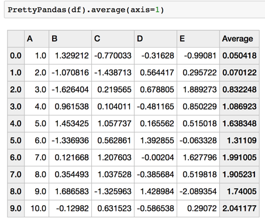

Add an average across and down the table:

```
PrettyPandas(df).average(axis=None)
```

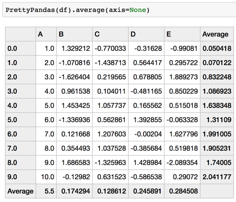

Summaries can chain together:

```
PrettyPandas(df).min().max()
```

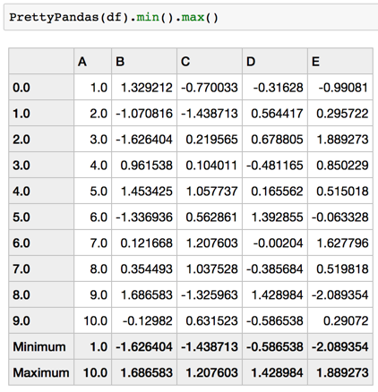

Custom functions can for summaries:

```
PrettyPandas(df).summary(np.mean, "Average")
```

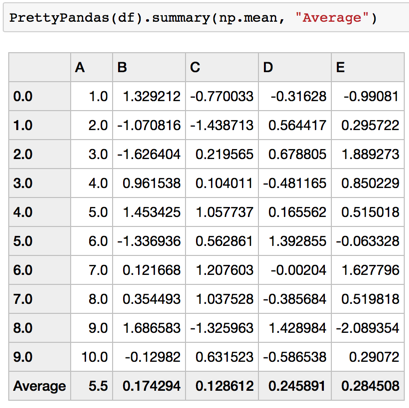

### Multiple Summary Functions

Multiple summaries can apply at the same time using the `multi_summary`
method.

```
PrettyPandas(df).multi_summary([np.mean, np.sum],
                               ['Average', 'Total'],
                               axis=0)
```

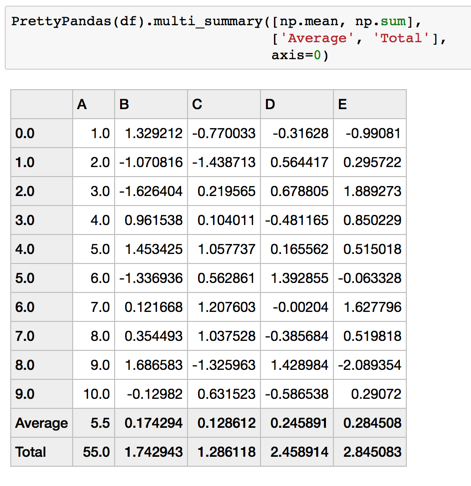


Multiple summaries have the exact same API as regular summaries so all the above
examples work with no surprises.

### Number Formatting

PrettyPandas has built in support for money, percentages, and units.

```
PrettyPandas(df).as_percent()
```

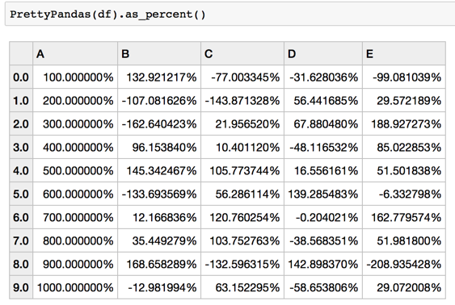


```
PrettyPandas(df).as_money()
```

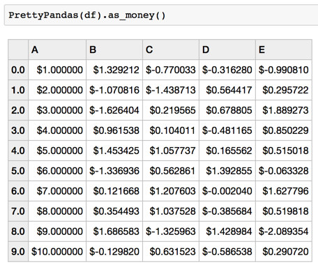


```
PrettyPandas(df).as_percent(precision=3)
```

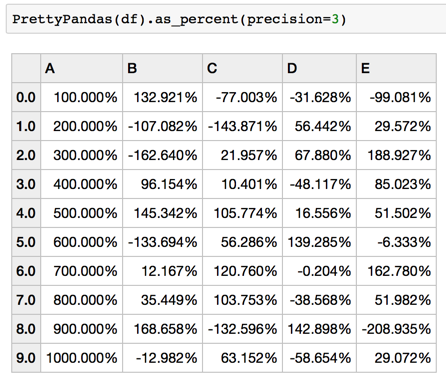


```
PrettyPandas(df).as_money(currency=u"$", precision=3)
```

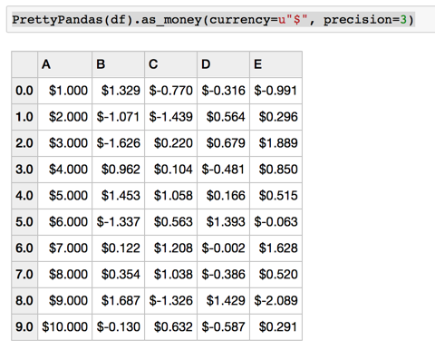


```
PrettyPandas(df).as_unit('cm', location='suffix')
```

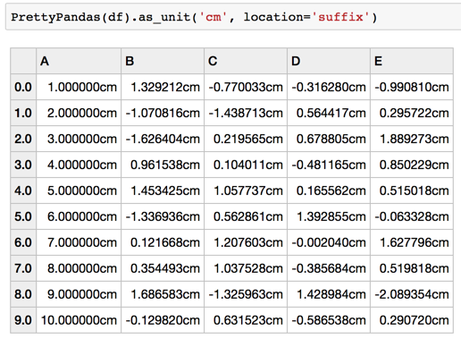


Number formatting conforms to standard Pandas indexing and slicing:

```
PrettyPandas(df).as_percent(subset=['A'])
```

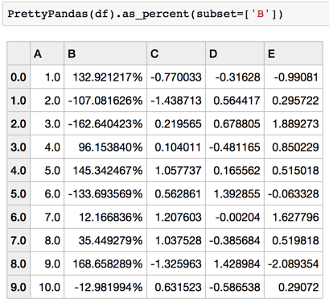


Number formats apply to summaries as well.

```
PrettyPandas(df).as_percent(subset=['A']).total()
```

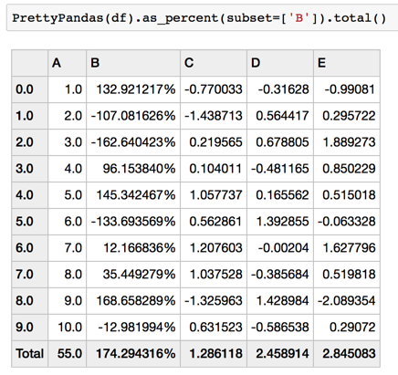

## Issues

* This class doesn't conform to the regular Styler.export function, which
means at the current time you cannot use the `export` and `style.use`
functions of a dataframe. Instead you can build a function which to
template table styles and use that to clone styles.

* Modifying the underlying dataset uses a copy and ignores any performance
issues. This means applying formats to large dataframes could be slow and
memory could be an issue.

* Summaries which you might want to interact (like the intersection of two
totals) will not render. This is a design decision because most summary
functions don't need to interact don't interact nicely.

* Summary functions don't take a subset argument which means that any
summary will apply to every column or row.

* Number formatting fails on nulls.

* No unit tests are currently implemented.
