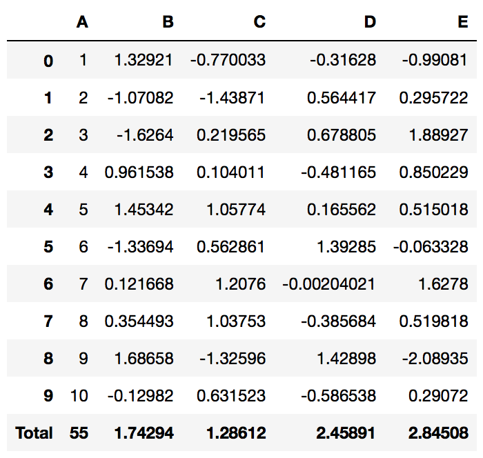
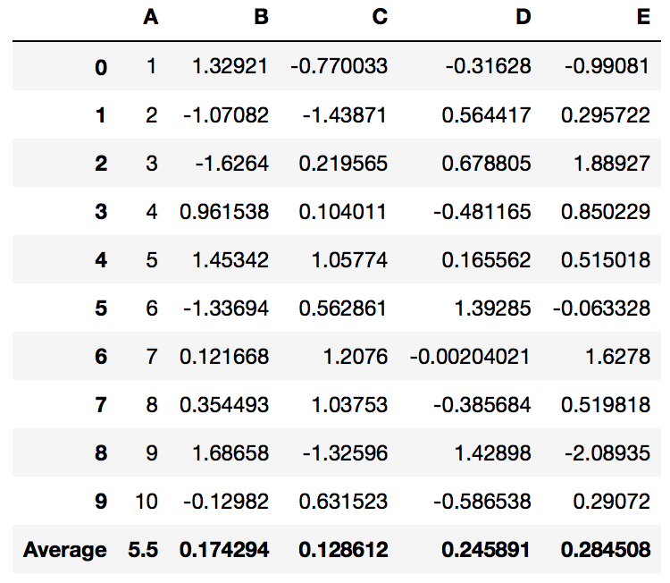
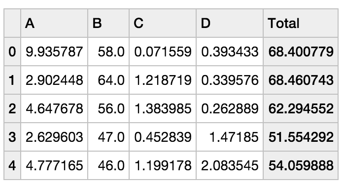
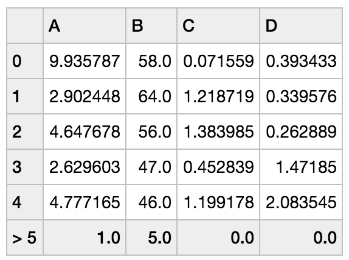
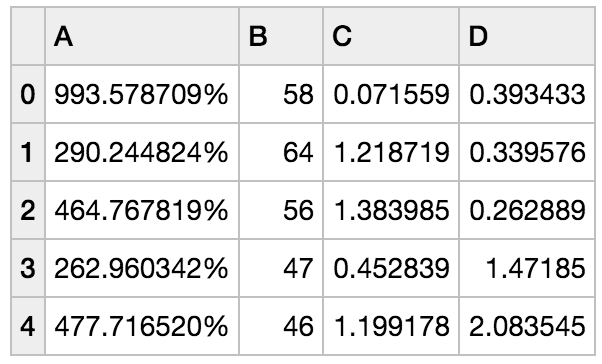
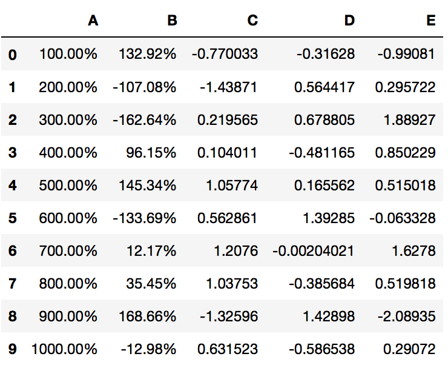
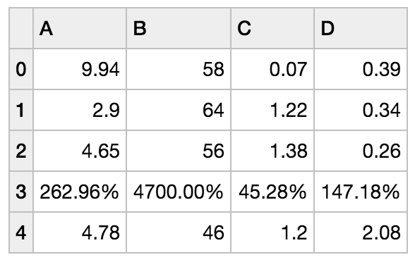
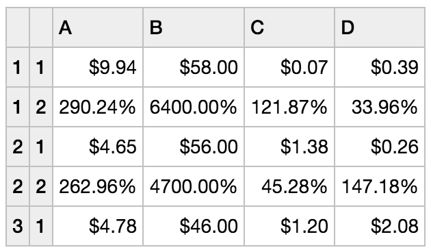

.. quickstart:

Quick Start
===========

Adding Summaries
----------------

PrettyPandas supports many built in summary functions, as well as providing the
ability to create your own summaries. Summary functions can be applied over
a DataFrame's rows or columns, or both.

The builtin summary methods are:

* :py:meth:`total <prettypandas.PrettyPandas.total>`
* :py:meth:`average <prettypandas.PrettyPandas.average>`
* :py:meth:`median <prettypandas.PrettyPandas.median>`
* :py:meth:`min <prettypandas.PrettyPandas.min>`
* :py:meth:`max <prettypandas.PrettyPandas.max>`

If you wanted to add a grand total to the bottom of your table the code is
simple:

.. code-block:: python

    PrettyPandas(df).total()

Or additionally if you want to use Pandas fluent API:

.. code-block:: python

    df.pipe(PrettyPandas).total()

PrettyPandas follows a fluent API so you can chain multiple summaries easily:

.. code-block:: python

    df.pipe(PrettyPandas).total().average()

The ``axis`` parameter specifies which ``numpy`` style axis to apply a summary
on --- 0 for columns, 1 for rows, and ``None`` for both.

.. code-block:: python

    PrettyPandas(df).total(axis=1)

You can even mix and match summaries applied to different axis.

Creating a Custom Summary
^^^^^^^^^^^^^^^^^^^^^^^^^

The :py:meth:`summary <prettypandas.PrettyPandas.summary>` method creates a custom summary
from a function which takes an array-like structure as a list.

.. code-block:: python

    def count_greater_than_five(items):
        return sum(item > 5 for item in items)

    PrettyPandas(df).summary(count_greater_than_five, title="> 5")

Formatting Numbers
------------------

Most reports use at least some units of measurement. PrettyPandas currently
supports percentages, money, and a more general unit method.

* :py:meth:`as_percent <prettypandas.PrettyPandas.as_percent>`
* :py:meth:`as_currency <prettypandas.PrettyPandas.as_currency>`
* :py:meth:`as_unit <prettypandas.PrettyPandas.as_unit>`

The ``as_unit`` method takes a positional ``unit`` argument which indicates the
string representing the unit to be used and a ``location`` argument to specify
whether the unit should be a prefix or suffix to the value.

The ``as_currency`` and ``as_percent`` methods are localized to use whatever
units your Python distribution thinks are best for you. If you aren't getting
the correct units use the :py:meth:`set_locale
<prettypandas.PrettyPandas.set_locale>` method to specify your locale.

If you need to use a different currency, just pass it to ``currency='...'`` to
change it.

The ``as_money`` method takes optional ``currency`` and ``location`` arguments
which work just like the ``as_unit`` method. By default the currency is in
dollars.

.. note::
    Python 2 doesn't support unicode literals by default. You can use `unicode
    literals`_ (e.g. ``u'€'``) or import the unicode literal behaviour from
    Python 3:

    .. code-block:: python

        from __future__ import unicode_literals

.. _unicode literals: https://docs.python.org/2/howto/unicode.html#unicode-literals-in-python-source-code

Formatting Columns
^^^^^^^^^^^^^^^^^^

By default the formatting methods apply to the entire dataframe. When you need
to format just a few columns you can use the `subset` argument to specify a
single column, or multiple columns.

.. code-block:: python

    PrettyPandas(df).as_percent(subset='A')  # Format just column A

.. code-block:: python

    PrettyPandas(df).as_percent(subset=['A', 'B'])  # Format columns A and B

Formatting Rows and Complex Formatting
^^^^^^^^^^^^^^^^^^^^^^^^^^^^^^^^^^^^^^

Formatting rows is more complicated than formatting columns. The `subset`
argument needs to take in a `pandas.Index` to specify the row.

.. code-block:: python

    # Format the row with row-index 3
    PrettyPandas(df, precision=2).as_percent(subset=pd.IndexSlice[3,:])

For multi-index dataframes subsetting is more complicated. You will need to use
multiple ``pandas.IndexSlice`` objects to get the correct rows.

The following example shows how to select rows in a multi-index:

.. code-block:: python

    idx = pd.IndexSlice
    first_row_idx = idx[:, 1]   # select all with index like (*, 1)
    second_row_idx = idx[:, 2]  # select all with index like (*, 2)

    (PrettyPandas(df2)
     .as_money(subset=idx[first_row_idx, :])
     .as_percent(subset=idx[second_row_idx, :])
     )

For more info on Pandas indexing, read `Pandas Indexing`_ and `Pandas Advanced
Indexing`_.

.. _Pandas Indexing: http://pandas.pydata.org/pandas-docs/stable/indexing.html
.. _Pandas Advanced Indexing: http://pandas.pydata.org/pandas-docs/stable/advanced.html

