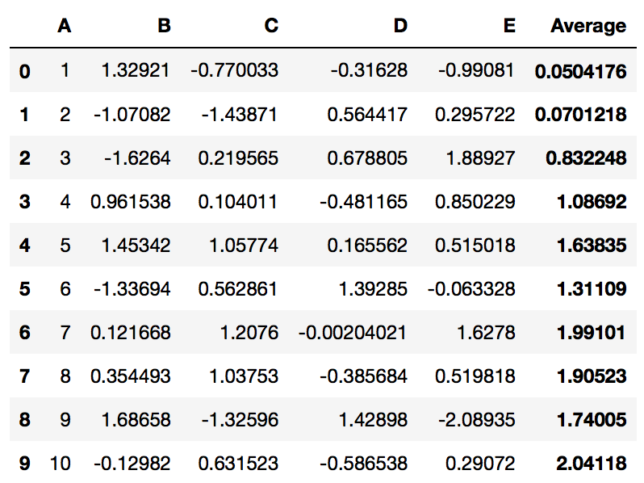
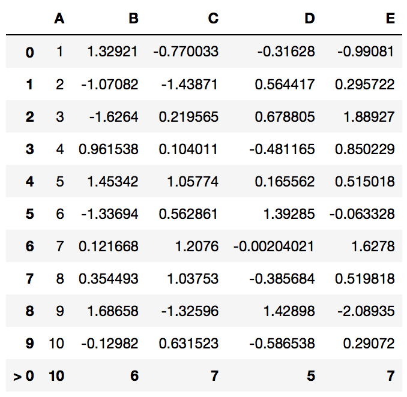
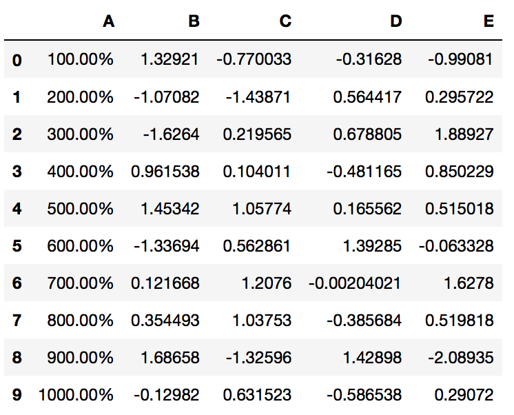
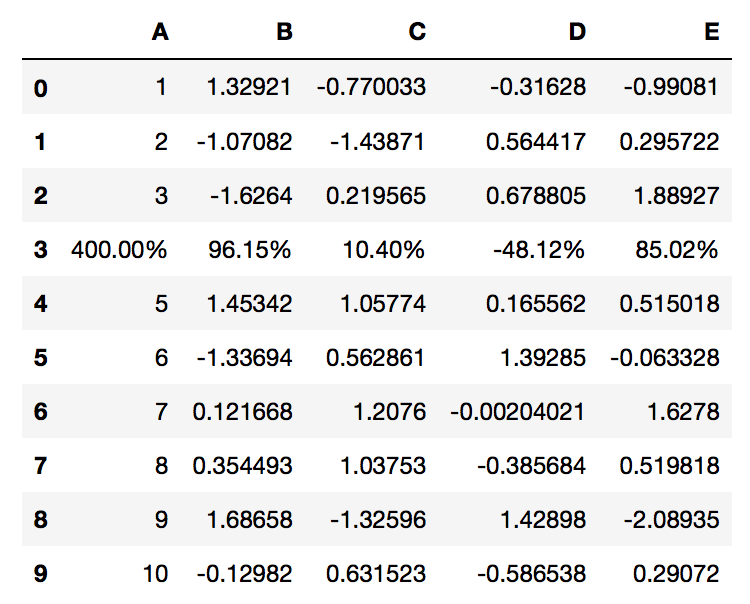
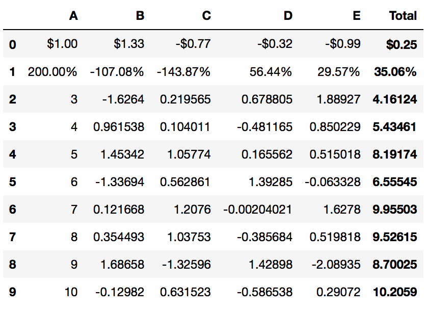

.. quickstart:

Getting Started
===============

Adding Style to a DataFrame
---------------------------

The PrettyPandas class takes advantage of the new `Pandas Style API`_ to create
custom tables for your dataframes. If you have a dataframe ``df``, this is how
that might look:

.. _Pandas Style API: http://pandas.pydata.org/pandas-docs/stable/style.html

.. code-block:: python

    from prettypandas import PrettyPandas

    table = PrettyPandas(df)

.. image:: _static/Images/1@2x.png
    :width: 276px

.. note::
    An instance of PrettyPandas is no longer the original dataframe but
    a presentation of the dataframe. That means you cannot use any of the
    standard transformations from the ``pandas.DataFrame`` class. The
    PrettyPandas instance can't change the original dataframe so there's no
    fear of contaminating your data.

Adding Summaries
----------------

PrettyPandas supports many different summary functions, as well the ability to
apply summaries along rows, columns, or both. Summaries chain together so you
can use multiple summaries without any headaches.

The builtin summary methods are:

* :py:meth:`total <PrettyPandas.total>`
* :py:meth:`average <PrettyPandas.average>`
* :py:meth:`median <PrettyPandas.median>`
* :py:meth:`min <PrettyPandas.min>`
* :py:meth:`max <PrettyPandas.max>`

The above functions work nicely on your table, if you wanted to add a grand
total to the bottom of your table the code is simple:

.. code-block:: python

    PrettyPandas(df).total()

And if you want to mix and match summaries:

.. code-block:: python

    PrettyPandas(df).total().average()
    

The ``axis`` parameter specifies which ``numpy`` style axis to apply a summary
on --- 0 for columns, 1 for rows, and ``None`` for both.

.. code-block:: python

    PrettyPandas(df).total(axis=1)

You can even mix and match summaries applied to different axis.

Creating a Custom Summary
^^^^^^^^^^^^^^^^^^^^^^^^^

The :py:meth:`summary <PrettyPandas.summary>` method creates a custom summary
from a function which takes an array-like structure as a list.

.. code-block:: python

    def count_greater_than_five(items):
        return sum(item > 5 for item in items)

    PrettyPandas(df).summary(count_greater_than_five, title="> 5")

Formatting Numbers
------------------

Most reports use at least some units of measurement. PrettyPandas currently 
supports percentages, money, and a more general unit method.

* :py:meth:`as_percent <PrettyPandas.as_percent>`
* :py:meth:`as_money <PrettyPandas.as_money>`
* :py:meth:`as_unit <PrettyPandas.as_unit>`

The ``as_unit`` method takes a positional ``unit`` argument which indicates the
string representing the unit to be used and a ``location`` argument to specify
whether the unit should be a prefix or suffix to the value. 

The ``as_money`` method takes optional ``currency`` and ``location`` arguments
which work just like the ``as_unit`` method. By default the currency is in
dollars. 

.. note:: 
    Many currency symbols are unicode characters, which means Python 2 doesn't
    support them by default. You can use `unicode literals`_ (e.g. ``u'€'``) or
    import the unicode literal behaviour from Python 3:

    .. code-block:: python
        
        from __future__ import unicode_literals

    The same goes for ``as_unit``.

.. _unicode literals: https://docs.python.org/2/howto/unicode.html#unicode-literals-in-python-source-code

Decimal Precision
^^^^^^^^^^^^^^^^^

Number formatters will default to the decimal precision of the PrettyPandas
object, however precision can be specified manually with the ``precision``
argument.

.. code-block:: python

    PrettyPandas(df).as_money(precision=2)

.. image:: _static/Images/format_all@2x.png
    :width: 214px

Formatting Columns
^^^^^^^^^^^^^^^^^^

By default the formatting methods apply to the entire dataframe. When you need 
to format just a few columns you can use the `subset` argument to specify a 
single column, or multiple columns. 

.. code-block:: python

    PrettyPandas(df).as_percent(subset='A')  # Format just column A

.. code-block:: python

    PrettyPandas(df).as_percent(subset=['A', 'B'])  # Format columns A and B

Formatting Rows and Complex Formatting
^^^^^^^^^^^^^^^^^^^^^^^^^^^^^^^^^^^^^^

Formatting rows is more complicated than formatting columns. The `subset` 
argument needs to take in a `pandas.Index` to specify the row. 

.. code-block:: python

    # Format the row with row-index 3
    PrettyPandas(df, precision=2).as_percent(subset=pd.IndexSlice[3,:])

For multi-index dataframes subsetting is more complicated. You will need to use
multiple ``pandas.IndexSlice`` objects to get the correct rows.

The following example shows how to select rows in a multi-index:

.. code-block:: python

    idx = pd.IndexSlice
    first_row_idx = idx[:, 1]   # select all with index like (*, 1)
    second_row_idx = idx[:, 2]  # select all with index like (*, 2)

    (PrettyPandas(df2)
     .as_money(subset=idx[first_row_idx, :])
     .as_percent(subset=idx[second_row_idx, :])
     )

For more info on Pandas indexing, read `Pandas Indexing`_ and `Pandas Advanced
Indexing`_.

.. _Pandas Indexing: http://pandas.pydata.org/pandas-docs/stable/indexing.html
.. _Pandas Advanced Indexing: http://pandas.pydata.org/pandas-docs/stable/advanced.html

The Magic Function
------------------

The :py:func:`apply_pretty_globals` function will patch your notebook so that
all tables are styled the same. This injects HTML into the notebook (which
some hosts don't allow).
